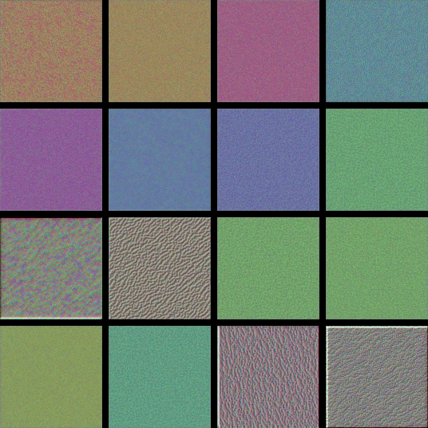
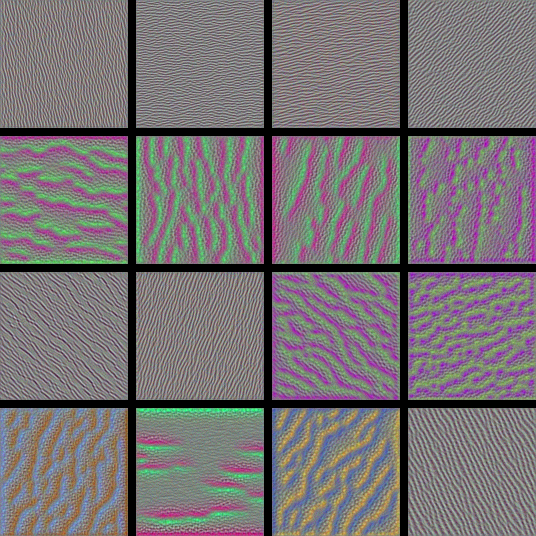
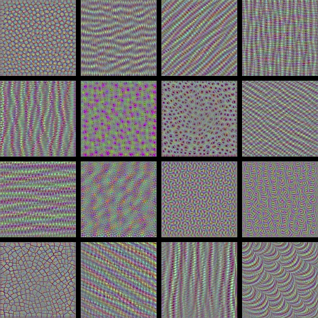
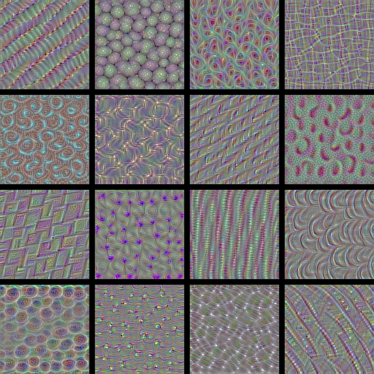
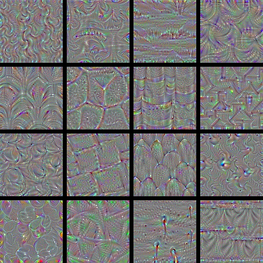

## Understanding Convolutional Neural Networks

Visualizing ConvNet layers provide a deep Understanding of how neural networks see the world. Maximizing the responses from conv filters give us a neat visualization of the convnet's modular-hierarchical decomposition of its visual space. The first layers basically just encode direction and color. These direction and color filters then get combined into basic grid and spot textures. These textures gradually get combined into increasingly complex patterns. The filters become more intricate as they start incorporating information from an increasingly larger spatial extent.

Here are some images produced by the python code provided. These are visualizations of conv filters from the VGG16 (also called OxfordNet) image classification model.

##### block1_conv2

##### block2_conv2

##### block3_conv3

##### block4_conv1

##### block5_conv1

